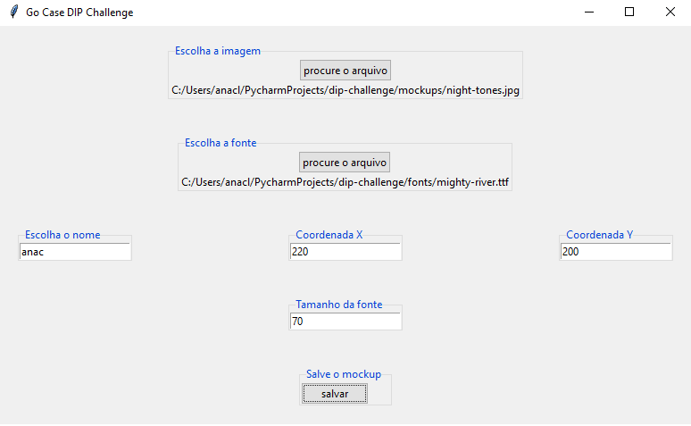
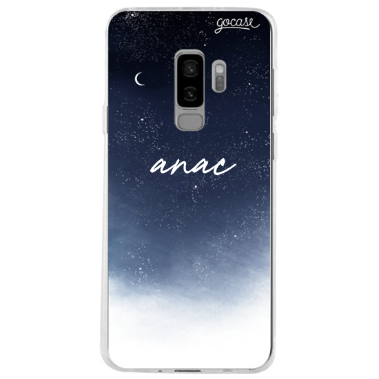

# Go Case - Digital Image Processing Challenge

For the code challenge I decided on making a simple, yet efficient, GUI, so that the input could be easily acquired. 

## how to use the application

While running the application, the user should see a GUI like the one above. Then, when clicking on 'Escolha a imagem> procure o arquivo', a file picker should open itself, and the user will choose a mockup image to test.
After that, upon clicking on the next button, the user should choose also the font file (in ttf) with another file picker.
Then, the first text box should be filled with the name one might want to see in their mockup, the second one with the x position, and the third with the y position. The last text box, then, refers to the font size.
Then, when the button 'salvar' is clicked, the application opens a mockup image like the one bellow, and the image saves itself on the application's root file.

## Additional questions

To avoid the possibility of the customization being plotted on certain regions, I would get the user's input of the model of the phone and make a mask of the regions that should be blocked on the phone case. Then, if the user's customization collided with these objects, the customization would not register. 
To the problem with small and big names, I would probably set fixed maximum and minimum widths for the name, and before plotting the name, the application would, based on the font size and name size, regulate the name object to fit on the range setted. 
And, for the last problem related with the difference between the preview and the real colors of the products, I would take pictures of the product under different lighting ambients and put it on display, so that the user's expectancy could be more accurate.
